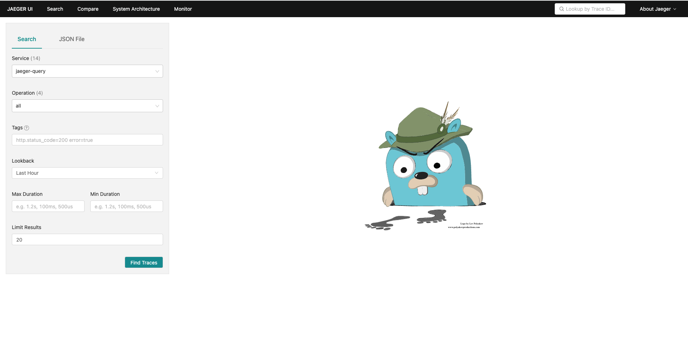
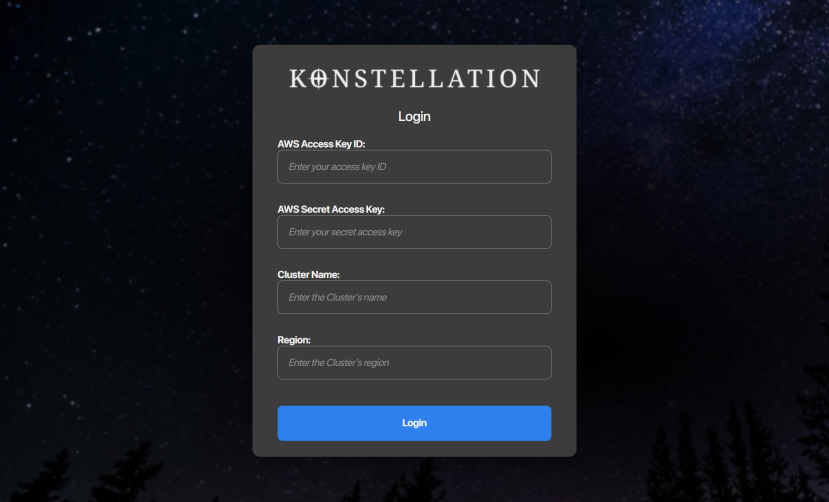
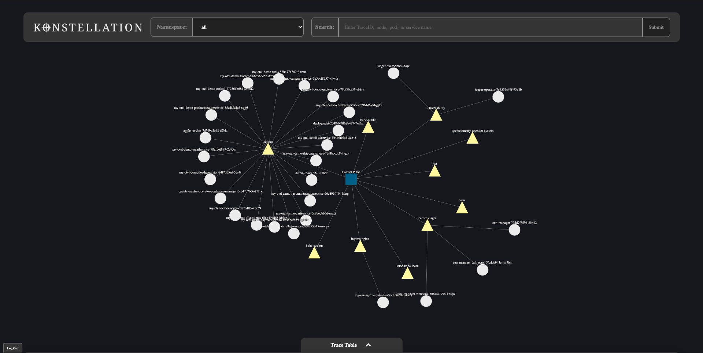
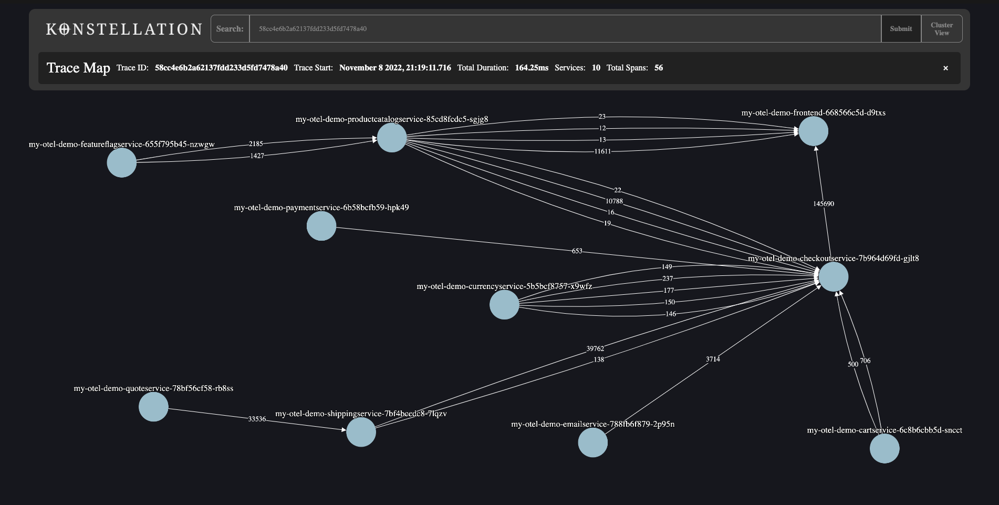

# 

# Summary
Konstellation is a Distributed Tracing tool for AWS EKS Kubernetes clusters and unmanaged Kubernetes clusters.

This tool gathers telemetry data within a kubernetes cluster and displays the connections in an easy to understand User Graphical Interface.

Please read the [website](http://konstellationapp.com/) and [medium](https://medium.com/@katalystyt0/kubernetes-clusters-visualization-with-konstellation-647d61aa817b) article for more information.

# Getting Started
Prerequisites:
- [ ] Kubectl Installed
- [ ] cert-manager installed
- [ ] Opentelemetry collector and operator deployed on the cluster
- [ ] Opentelemetry instrumentation integrated within your app.
- [ ] Jaeger deployed on the cluster

Check out our [QuickStart](#quickstart) section for instructions on how to quickly setup the application.

*Note*
- If your App is not instrumented with Opentelemetry instrumentation, the following instructions will provide a method to instrument a NodeJS, Python, or Java app with Opentelemetry Autoinstrumentation. Do note that errors may arise do due to a known issue with NodeJS native fetch and Opentelemetry's Autostrumentation, inter-pod traces will not correctly propagate.

- Custom deployment of the Opentelemetry Operator Collector, and the deployment of the Jaeger Operator Operator and collector is possible. As long as the `Jaeger-frontend` is exposed on `localhost:16686`, Konstellation can be used.

- The app has been tested to work on AWS EKS and unmanaged clusters, this application may work with other cloud kubernetes providers, but support for those systems has not yet been tested.

# Installing Kubectl
- Instructions to install kubectl [here](https://kubernetes.io/docs/tasks/tools/)

## Install with Homebrew on macOS
If you are on macOS and using [Homebrew](http://brew.sh) package manager, you can install kubectl with Homebrew.
1. Run the installation command:

```
brew install kubectl
```

or

```
brew install kubernetes-cli
```

2. Test to ensure the version you installed is up-to-date:

```
kubectl version --client
```

# Installing cert-manager
- Detailed Instructions for installing `cert-manager` [here](https://cert-manager.io/docs/installation/)

To install cert-manager run:

```
kubectl apply -f https://github.com/cert-manager/cert-manager/releases/download/v1.10.0/cert-manager.yaml
```

# Setting up Opentelemetry Operator and Collector
- Detailed instructions for installing the Opentelemetry Operator and Collector are found [here](https://github.com/open-telemetry/opentelemetry-operator)

To install the operator and collector. Please ensure cert-manager is installed. The Opentelemetry Operator and Collector may be installed via  helm chart or manually

## (Optional) Install Via Helm chart
You can install Opentelemetry Operator via [Helm Chart](https://github.com/open-telemetry/opentelemetry-helm-charts/tree/main/charts/opentelemetry-operator) from the opentelemetry-helm-charts repository. More information is available in [here](https://github.com/open-telemetry/opentelemetry-helm-charts/tree/main/charts/opentelemetry-operator).

## Install Opentelemetry Operator
Once cert-manager is installed:

```bash
kubectl apply -f https://github.com/open-telemetry/opentelemetry-operator/releases/latest/download/opentelemetry-operator.yaml
```

Once the `opentelemetry-operator` deployment is ready, create an OpenTelemetry Collector (otelcol) instance:

The OpenTelemetry collector yaml file is provided in the konstellation-yaml Folder. Run the following command: 

```
kubectl apply -f ./konstellation-yaml/setup/03-opentelemetry-collector.yaml
```


This will create an OpenTelemetry instance named `otel`, exposing a `jaeger-grpc` port to consume spans from your instrumented applications and exporting those spans via `logging`, which writes the spans to the console (`stdout`) of the OpenTelemetry Collector instance that receives the span and to the `jaeger-collector`.


# (Optional) Setting up Opentelemetry Autoinstrumentation Injection
- Only required if your app does not have Opentelemetry's Autoinstrumentation built in. Do not set up Opentelemetry auoinstrumentation injection if your app is already instrumented with Opentelemetry SDK tools.

The operator can inject and configure OpenTelemetry auto-instrumentation libraries. Currently DotNet, Java, NodeJS and Python are supported.

To use auto-instrumentation, configure an `Instrumentation` resource with the configuration for the SDK and instrumentation.

The requisite autoinstrumentation yaml file is located in the konstellation-yaml folder. To apply the instrumentation run:

```bash
kubectl apply -f ./konstellation-yaml/05-konstellation-autoinstrumentation.yaml
```

Then add an annotation to a pod to enable injection. The annotation can be added to a namespace, so that all pods within that namespace will get instrumentation, or by adding the annotation to individual PodSpec objects, available as part of Deployment, Statefulset, and other resources.

Java:
```
instrumentation.opentelemetry.io/inject-java: "true"
```

NodeJS:
```
instrumentation.opentelemetry.io/inject-nodejs: "true"
```

Python:
```
instrumentation.opentelemetry.io/inject-python: "true"
```

DotNet:
```
instrumentation.opentelemetry.io/inject-dotnet: "true"
```

For example, running the following command will patch the `default` namespace to allow Node-JS autoinstrumentation injection.

```
kubectl patch namespace default -p '{"metadata":{"annotations":{"instrumentation.opentelemetry.io/inject-nodejs": "true"}}}'
```

# Setting up Jaeger Operator and Collector
- Documentation to set up the Jaeger Operator on a Kubernetes cluster [here](https://www.jaegertracing.io/docs/1.39/operator/)

Before installing the Jaeger Operator. Please ensure cert-manager is installed.

To Install the Operator, run: 

```
kubectl create namespace observability # <1>
kubectl create -f https://github.com/jaegertracing/jaeger-operator/releases/download/v1.39.0/jaeger-operator.yaml -n observability # <2>

```
- The first command will create a namespace on your cluster named observability.
- The second command will create the jaeger operator in the observability namespace.

Once the Jaeger operator has been set up, we will need to create an instance of the jaeger collector on the cluster.

To create a Jaeger collector with the following command

``` 
kubectl apply -f ./konstellation-yaml/setup/04-jaegerconfig.yaml
```

# Port-Forwarding Jaeger

Konstellation requires port-forwarding of Jaeger to `localhost:16686` to function.

Run the following command to port-forward Jaeger to your `localhost:16686`

```bash
kubectl port-forward jaeger-collector 16686:16686
```

Open a browser and navigate to  `http://localhost:16686`. The jaeger UI should load.



# Quickstart
The quickstart instructions will require that [`kubectl`](#installing-kubectl) is set up and [`cert-manager`](#installing-cert-manager) is installed. 

The following commands will create and deploy the and `jaeger operator` in the observability namespace and the `opentelemetry operator`.

```
kubectl apply -f ./konstellation-yaml/setup/runFirst.yaml 
```

Once the `jager operator` and `opentelemetry operator` pods are deployed, run the following command.

```
kubectl apply -f ./konstellation-yaml/setup/runSecond.yaml
```

This second command will configure an opentelemetry collector and jaeger collector in the default namespace. It will addionally set up autoinstrumentation for Node-JS in the default namespace and add an annotation to the namespace to allow the Operator to inject the autoinstrumentation to all pods in the namespace.

Once the jaeger collector has been set up, port-forward the jaeger collector to your http://localhost:16686

```
kubectl port-forward services/jaeger-query 16686:16686
```


# Running the Application

Once all of the prerequisite conditions are met, and jaeger is port-forwarded to `localhost:16686`, run the following commands.
```
npm install
```

Once all of the npm dependencies are installed, run:
```
npm start
```
Navigate to `localhost:8080` to run the application

1. On successful startup, if you are not connected to your AWS cluster, please enter your AWS credentials, otherwise the app will proceed to the cluster map view.



2. To view a list of traces click on the table tab at the bottom of the screen.

3. To view a specific trace, click on the trace ID on the table.

4. To return to the clusterView click on the clusterView button.


5. To view a specific trace, if the trace Id is known, enter the traceId at the search bar on the top and click submit.

# Known Issues
- There is a known issue regarding apple silicon Macbooks causing incompatibility with the canvas npm module. 
To solve the issue, run:
```
arch -arm64 brew install pkg-config cairo pango libpng jpeg giflib librsvg
```
More information can be found [here](https://github.com/Automattic/node-canvas/issues/1733#issuecomment-808916786)

# Authors

Jonathan Le [Github](https://github.com/lejon1220)/[LinkedIn]

Matthew Antosiak [Github](https://github.com/Jaitnium)/[LinkedIn](https://linkedin.com/in/matthewantosiak)

Kathyrn Tsai [Githib](https://github.com/katalystkat)/[LinkedIn](https://linkedin.com/in/ck-tsai/)

Richard Roberts [Github](https://github.com/Richard-Roberts)/[LinkedIn](https://www.linkedin.com/in/richard--roberts/)

Drew Dunne [Github](https://github.com/drewdunne)/[LinkedIn](https://www.linkedin.com/in/andrew-dunne-7620bb84/)
